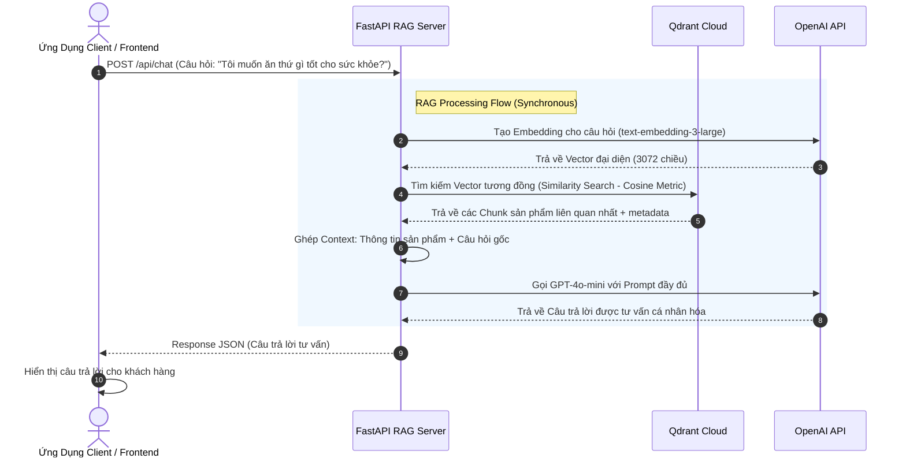

# 🚀 Hệ Thống RAG AI Hỗ Trợ Khách Hàng (Base Project)

Dự án này là một **base project** được thiết kế **đơn giản nhất có thể**, không over-engineering, nhằm giúp bạn tự học, tự chạy và hiểu rõ luồng hoạt động **end-to-end** của một hệ thống **Retrieval-Augmented Generation (RAG)** thực tế sử dụng OpenAI embeddings, Qdrant Vector DB, và GPT-4o-mini LLM.

---

## 🗺️ Luồng hoạt động của hệ thống (End-to-End Flow)

Dưới đây là sơ đồ chuỗi hoạt động từ lúc khách hàng hỏi câu hỏi cho đến khi AI trả lời bằng tri thức được nạp sẵn:



---

## 📚 Giải thích các khái niệm cốt lõi (RAG Core Concepts)

Để làm chủ AI Engineering, dưới đây là những kiến thức nền tảng mà bạn cần nắm chắc qua mã nguồn dự án này:

### 1. Tại sao cần Embedding? (What & Why is Embedding?)
*   **Vấn đề**: Máy tính chỉ hiểu số, không hiểu chữ. Nếu ta tìm kiếm bằng từ khóa (ví dụ: `Ctrl+F` hoặc `SQL LIKE`), hệ thống sẽ bỏ sót các từ đồng nghĩa.
    *   *Ví dụ*: Bạn tìm "giờ làm việc", nhưng tài liệu viết là "khung giờ mở cửa". Tìm kiếm từ khóa thông thường sẽ thất bại.
*   **Giải pháp (Embedding)**: Là quá trình chuyển đổi một chuỗi văn bản (từ, câu hoặc đoạn văn) thành một danh sách các số thực (gọi là **Vector**). Trong dự án này, mô hình `text-embedding-3-large` chuyển văn bản của bạn thành một vector **3072 chiều**.
*   **Ý nghĩa hình học**: Embedding ánh xạ văn bản vào một không gian đa chiều (Semantic Space). Những đoạn văn bản có ý nghĩa, ngữ cảnh tương đồng nhau sẽ có các vector nằm rất gần nhau trong không gian này.
    *   Vector của `"giờ làm việc"` sẽ nằm rất gần vector của `"thời gian mở cửa"`.

### 2. Chunking là gì? (What is Chunking?)
*   **Định nghĩa**: Chunking là kỹ thuật chia nhỏ một văn bản dài thành các đoạn văn ngắn (chunks) trước khi tạo embedding và lưu vào database. Trong file `rag_service.py`, hàm `chunk_text` chia nhỏ tài liệu dựa trên kích thước ký tự (`chunk_size=500` ký tự) và độ gối đầu (`chunk_overlap=50` ký tự).
*   **Tại sao phải Chunking?**
    1.  **Hạn chế của LLM**: Các mô hình ngôn ngữ (như GPT) đều có giới hạn ngữ cảnh đầu vào (Context Window). Chúng ta không thể gửi cả một tài liệu hướng dẫn 200 trang vào mỗi câu hỏi.
    2.  **Độ chính xác ngữ nghĩa**: Tìm kiếm vector trên một đoạn văn ngắn và cô đọng (như "Chính sách đổi trả hàng là 7 ngày") sẽ cho kết quả chính xác hơn nhiều so với tìm kiếm trên toàn bộ một chương sách dài chứa nhiều chủ đề hỗn tạp.
    3.  **Độ gối đầu (Overlap)**: Giúp giữ lại ngữ cảnh liền mạch ở ranh giới giao nhau giữa các đoạn cắt, tránh mất thông tin cốt lõi khi câu văn bị cắt đôi.

### 3. Vector Database & Tìm kiếm tương đồng (Similarity Search)
*   **Vector Database (Qdrant)**: Là cơ sở dữ liệu chuyên biệt được tối ưu hóa để lưu trữ và truy vấn hàng triệu vector với tốc độ cực nhanh.
*   **Cơ chế hoạt động**: Thay vì lưu và đối chiếu text thô, Qdrant lưu trữ các vector kèm theo phần thông tin bổ trợ (**Payload** - chính là văn bản gốc để LLM đọc).
*   **Similarity Search (Tìm kiếm tương đồng)**: Khi người dùng đặt câu hỏi, chúng ta tạo vector cho câu hỏi đó, rồi gửi lên Qdrant. Qdrant sẽ sử dụng các phép toán khoảng cách hình học (dự án này dùng **Cosine Similarity** - so khớp góc giữa 2 vector) để tìm ra top `N` đoạn văn bản có hướng vector gần với câu hỏi nhất.

### 4. RAG Flow hoạt động như thế nào?
RAG (Retrieval-Augmented Generation) giải quyết yếu điểm lớn nhất của LLM là **Hallucination (Ảo tưởng/Bịa đặt thông tin)** và **Thiếu tri thức nội bộ** bằng cách kết hợp 3 bước:
1.  **Retrieval (Tìm kiếm)**: Khi user hỏi, hệ thống truy vấn Vector DB tìm ra các thông tin chính xác liên quan.
2.  **Augmentation (Gộp ngữ cảnh)**: Nhúng các thông tin tìm được vào cấu trúc Prompt định sẵn để tạo thành một yêu cầu giàu thông tin cho LLM.
3.  **Generation (Sinh đáp án)**: LLM đóng vai trò là bộ não đọc hiểu, tổng hợp thông tin từ ngữ cảnh được cung cấp để đưa ra câu trả lời chuẩn xác nhất cho người dùng.

---

## 🔌 API Endpoints & Cách Sử Dụng

Hệ thống RAG cung cấp các endpoint sau để ứng dụng client sử dụng:

*   **`POST /api/chat`**: Endpoint chính để gửi câu hỏi và nhận câu trả lời RAG.
*   **`POST /ingest`**: Nạp tài liệu tri thức dạng text vào Vector DB.
*   **`POST /ingest/product`**: Nạp hoặc cập nhật một sản phẩm vào Vector DB.
*   **`POST /ingest/products/bulk`**: Nạp hàng loạt nhiều sản phẩm.
*   **`DELETE /ingest/product/{product_id}`**: Xóa vector của một sản phẩm.
*   **`GET /health`**: Kiểm tra trạng thái hệ thống.

---

## 🛠️ Hướng dẫn cài đặt và chạy cục bộ (Local Setup)

### 1. Chuẩn bị môi trường & Cấu hình `.env`
Sao chép file cấu hình mẫu và chỉnh sửa các thông số:
```bash
cp .env.example .env
```
Mở file `.env` vừa tạo và điền các thông tin:
```ini
OPENAI_API_KEY=sk-proj-xxxxxxxxxxxxxxxxxxxxxxxxxxxx # API Key từ OpenAI
QDRANT_URL=https://xxxx-xxxx.aws.qdrant.io:6333     # URL Qdrant Cloud của platform
QDRANT_API_KEY=xxxxxxxxxxxxxxxxxxxxxxxxxxxxxxxxxxxx # API Key của Qdrant Cloud
PORT=8000                                            # Port chạy FastAPI Server (Optional)
```
*(Lưu ý: Dự án có sẵn file `docker-compose.yml` để chạy Qdrant local, tuy nhiên ở phase này bạn đang tắt Qdrant local để kết nối trực tiếp tới Qdrant Cloud của platform nên không cần chạy docker-compose).*

### 2. Cài đặt các thư viện Python
Nên sử dụng môi trường ảo (virtual environment) để giữ sạch hệ thống:
```bash
# Tạo môi trường ảo
python -m venv venv

# Kích hoạt môi trường ảo
# Trên Windows (Command Prompt):
.\venv\Scripts\activate
# Hoặc trên Windows (PowerShell):
.\venv\Scripts\Activate.ps1
# Trên macOS/Linux:
source venv/bin/activate

# Cài đặt thư viện
pip install -r requirements.txt
```

### 3. Chạy Server FastAPI
Khởi chạy server bất đồng bộ Uvicorn:
```bash
python main.py
```
Server sẽ chạy mặc định tại: `http://localhost:8000`. Bạn có thể truy cập `http://localhost:8000/docs` để xem tài liệu Swagger UI trực quan và test thử các API.

---

## 🐳 Hướng dẫn chạy bằng Docker (Docker Setup)

Dự án đã được cấu hình sẵn `Dockerfile` (sử dụng Multi-stage build để tối ưu dung lượng) và `docker-compose.yml` để bạn dễ dàng triển khai.

### ⚠️ Lưu ý quan trọng trước khi chạy
Hãy chắc chắn rằng bạn đã tạo và cấu hình đầy đủ file `.env` từ `.env.example` trước khi khởi chạy Docker:
```bash
cp .env.example .env
# Mở file .env và điền các API Key của OpenAI, Qdrant và Chatwoot
```

### Cách 1: Sử dụng Docker Compose (Khuyến nghị)

Đây là cách nhanh nhất và tiện lợi nhất vì nó tự động build và nạp cấu hình từ file `.env` của bạn.

1. **Khởi chạy container ở chế độ chạy ngầm (detached mode):**
   ```bash
   docker compose up -d --build
   ```

2. **Kiểm tra trạng thái hoạt động của container:**
   ```bash
   docker compose ps
   ```

3. **Xem nhật ký hoạt động (Logs):**
   ```bash
   docker compose logs -f
   ```

4. **Dừng hệ thống:**
   ```bash
   docker compose down
   ```

---

### Cách 2: Sử dụng Docker CLI (Thủ công)

Nếu bạn không muốn sử dụng Docker Compose, bạn có thể build và chạy container bằng các lệnh Docker cơ bản:

1. **Build Docker Image:**
   ```bash
   docker build -t fastapi-rag-app .
   ```

2. **Chạy Docker Container:**
   Nạp trực tiếp file cấu hình `.env` thông qua tham số `--env-file`:
   ```bash
   docker run -d \
     --name fastapi_rag_app \
     -p 8000:8000 \
     --env-file .env \
     --restart always \
     fastapi-rag-app
   ```

3. **Kiểm tra logs:**
   ```bash
   docker logs -f fastapi_rag_app
   ```

4. **Dừng và xóa container:**
   ```bash
   docker stop fastapi_rag_app && docker rm fastapi_rag_app
   ```

---

Sau khi khởi chạy bằng Docker thành công, ứng dụng sẽ chạy tại `http://localhost:8000`. Bạn có thể truy cập `http://localhost:8000/docs` hoặc endpoint `GET /health` để kiểm tra.

---

## 🧪 Ví dụ Request / Response (API Testing)

### 1. Kiểm tra trạng thái hệ thống (`GET /health`)
**Request**:
```bash
curl -X GET http://localhost:8000/health
```
**Response**:
```json
{
  "status": "healthy",
  "openai_api": "configured",
  "qdrant": "connected"
}
```

---

### 2. Nạp dữ liệu tri thức (`POST /ingest`)
Hãy gửi các tài liệu tri thức nội bộ của bạn (ví dụ: Quy chế công ty, Chính sách bán hàng) vào đây để nạp tri thức cho AI Bot.

**Request**:
```bash
curl -X POST http://localhost:8000/ingest \
-H "Content-Type: application/json" \
-d '{
  "text": "Vibe Code hỗ trợ chính sách đổi trả hàng hóa trong vòng 7 ngày kể từ ngày mua hàng. Sản phẩm đổi trả phải còn nguyên tem mác, chưa qua sử dụng và có hóa đơn mua hàng đi kèm. Hỗ trợ hoàn tiền 100% qua tài khoản ngân hàng hoặc đổi sản phẩm mới tương đương."
}'
```
**Response**:
```json
{
  "status": "success",
  "message": "Nạp tài liệu tri thức thành công!",
  "chunks_created": 1
}
```

---

### 3. Gửi câu hỏi để nhận câu trả lời RAG (`POST /api/chat`)
Endpoint chính để gửi câu hỏi và nhận câu trả lời được AI tư vấn dựa trên tri thức đã nạp.

**Câu hỏi bằng tiếng Việt**:
```bash
curl -X POST http://localhost:8000/api/chat \
-H "Content-Type: application/json" \
-d '{
  "query": "Tôi muốn ăn thứ gì tốt cho sức khỏe? Có sản phẩm nào giúp tăng cường miễn dịch không?",
  "history": []
}'
```

**Câu hỏi bằng tiếng Anh (Kiểm tra tính năng đa ngôn ngữ)**:
```bash
curl -X POST http://localhost:8000/api/chat \
-H "Content-Type: application/json" \
-d '{
  "query": "What healthy food products do you recommend?",
  "history": []
}'
```

**Response (Câu trả lời từ AI)**:
```json
{
  "status": "success",
  "answer": "Dựa trên cơ sở dữ liệu sản phẩm của chúng tôi, tôi gợi ý các sản phẩm tốt cho sức khỏe như: ..."
}
```

---

## 🗂️ Nạp nội dung trang web tĩnh vào Vector DB (Static Content Ingestion)

Ngoài dữ liệu sản phẩm, chatbot còn cần trả lời các câu hỏi về **thông tin cửa hàng** như: giới thiệu, liên hệ, chính sách giao hàng, đổi trả, thanh toán, bảo mật... Những thông tin này nằm rải rác trong các trang tĩnh của website Laravel (`about`, `contact`, `faq`, `service`, `footer`...).

Script **`ingest_static_content.py`** tổng hợp các thông tin đó thành **10 tài liệu tri thức** theo từng chủ đề (mỗi chủ đề nạp riêng để giữ ngữ cảnh mạch lạc, giúp Semantic Search chính xác hơn) rồi nạp thẳng vào Qdrant.

Script gọi **trực tiếp** hàm `async_ingest_document` trong `rag_service.py`, nên **không cần** FastAPI server phải đang chạy — chỉ cần file `.env` đã cấu hình `OPENAI_API_KEY` và `QDRANT_URL` / `QDRANT_API_KEY`.

**Cách chạy** (từ thư mục `food-support-rag`):
```bash
# Windows (PowerShell / Git Bash) — cần PYTHONIOENCODING để không lỗi tiếng Việt trên console cp1252
PYTHONIOENCODING=utf-8 ./venv/Scripts/python.exe ingest_static_content.py

# macOS / Linux
PYTHONIOENCODING=utf-8 ./venv/bin/python ingest_static_content.py
```

**Kết quả mong đợi:**
```text
--- Bắt đầu nạp 10 tài liệu tĩnh vào Qdrant ---

  [OK] 'Giới thiệu về KFood' -> 2 chunks
  [OK] 'Thông tin liên hệ KFood' -> 1 chunks
  ...
--- Hoàn tất: 10/10 tài liệu nạp thành công ---
```

> 💡 Khi nội dung trang tĩnh thay đổi, chỉ cần cập nhật danh sách `KNOWLEDGE_DOCS` trong script rồi chạy lại. Các tài liệu này được gắn nhãn `doc_type = "general_knowledge"` trong Qdrant để phân biệt với dữ liệu sản phẩm.

---

## 📁 Cấu trúc File & Nhiệm vụ cụ thể
*   **`main.py`**: Trái tim của ứng dụng FastAPI. Định nghĩa các Router API (`/api/chat`, `/ingest`, `/ingest/product`, `/health`), xử lý request và response đồng bộ.
*   **`rag_service.py`**: Chứa toàn bộ "phép thuật" về AI & Vector Database. Thực hiện chia nhỏ text (Chunking), gọi API tạo Embeddings (3072 chiều), truy vấn Qdrant Cloud, và tạo System Prompt đa ngôn ngữ để gửi cho GPT-4o-mini.
*   **`ingest_static_content.py`**: Script tiện ích nạp nội dung các trang web tĩnh (giới thiệu, liên hệ, FAQ, chính sách giao hàng/đổi trả, thanh toán, dịch vụ...) thành các tài liệu tri thức và đưa vào Qdrant. Gọi trực tiếp `async_ingest_document`, không cần server chạy.
*   **`requirements.txt`**: Danh sách các thư viện Python cần cài đặt (fastapi, uvicorn, httpx, qdrant-client, openai, python-dotenv).
*   **`.env` & `.env.example`**: File cấu hình môi trường chứa API Keys và URLs kết nối.
