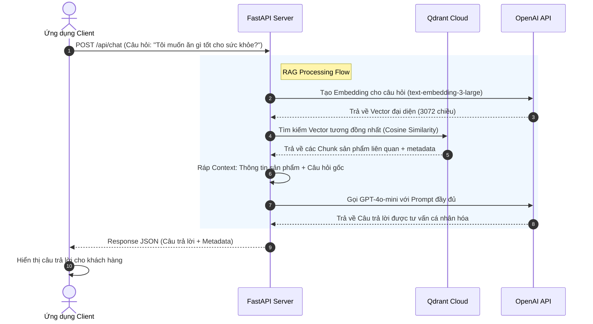

# Kế hoạch triển khai: Hệ Thống RAG AI Hỗ Trợ Khách Hàng

Dự án này nhằm mục đích xây dựng một hệ thống Retrieval-Augmented Generation (RAG) đơn giản, trực quan và dễ hiểu nhất để người học có thể nắm vững luồng hoạt động end-to-end từ lúc nhận câu hỏi, embedding câu hỏi, tìm kiếm vector database Qdrant, gửi context cho OpenAI LLM và trả lời bằng câu tư vấn được AI sinh ra.

---

## Cấu trúc thư mục đề xuất

Để giữ cho dự án đơn giản, trực quan và không bị "over-engineering", chúng ta sẽ tổ chức code theo cấu trúc phẳng nhưng phân chia nhiệm vụ rõ ràng:

```text
food-support-rag/
├── docker-compose.yml     # Tùy chọn: Khởi chạy Qdrant Vector Database cục bộ
├── requirements.txt       # Các thư viện Python cần thiết
├── .env.example           # File cấu hình mẫu (OpenAI API Key, Qdrant URL)
├── README.md              # Tài liệu hướng dẫn cài đặt, chạy thử và giải thích lý thuyết
├── main.py                # FastAPI Application & Routing (Các endpoint POST /api/chat, POST /ingest, GET /health)
└── rag_service.py         # Logic xử lý RAG (Chunking, Embedding, Vector Search, LLM Prompt)
```

---

## Luồng hoạt động chi tiết (End-to-End Flow)



---

## Các thành phần chính và giải thích

### 1. File cấu hình & Môi trường chạy
*   **`docker-compose.yml`**: Tùy chọn: Khởi động Qdrant cục bộ trên port `6333` hoặc sử dụng Qdrant Cloud.
*   **`requirements.txt`**: Khai báo các thư viện:
    *   `fastapi` & `uvicorn` (xây dựng web API)
    *   `qdrant-client` (giao tiếp với Qdrant Cloud hoặc Local)
    *   `openai` (giao tiếp với OpenAI API)
    *   `python-dotenv` (quản lý biến môi trường)
    *   `httpx` (gửi request HTTP bất đồng bộ)
*   **`.env.example`**: Các cấu hình như `OPENAI_API_KEY`, `QDRANT_URL`, `QDRANT_API_KEY`, `PORT`.

### 2. Các file mã nguồn chính
*   **main.py**:
    *   Khởi tạo FastAPI app.
    *   Endpoint `GET /health`: Kiểm tra trạng thái hệ thống (OpenAI, Qdrant).
    *   Endpoint `POST /api/chat`: Nhận câu hỏi, thực hiện RAG đồng bộ và trả về câu trả lời.
    *   Endpoint `POST /ingest`: Nhận văn bản, thực hiện chunking, embedding và lưu vào Qdrant.
    *   Endpoint `POST /ingest/product`: Nhận thông tin sản phẩm, nạp/cập nhật vào Qdrant.
    *   Endpoint `POST /ingest/products/bulk`: Nạp hàng loạt nhiều sản phẩm.
    *   Endpoint `DELETE /ingest/product/{product_id}`: Xóa vector sản phẩm.
*   **rag_service.py**:
    *   *Chunking*: Chia nhỏ văn bản (kích thước 500 ký tự, overlap 50 ký tự).
    *   *Embedding*: Sử dụng `text-embedding-3-large` để chuyển văn bản sang vector 3072 chiều.
    *   *Vector Search*: Khởi tạo collection trong Qdrant, insert chunks, tìm kiếm cosine similarity.
    *   *LLM Prompt*: Xây dựng Prompt dạng:
        ```text
        Bạn là trợ lý ảo tư vấn cho khách hàng về sản phẩm thức ăn.
        Hãy trả lời dựa trên thông tin sản phẩm dưới đây.
        Nếu không có thông tin liên quan, nói "Tôi không có thông tin".
        
        Thông tin sản phẩm:
        {CONTEXT}
        
        Câu hỏi:
        {QUESTION}
        ```

---

## Kế hoạch xác minh (Verification Plan)

### Kiểm thử tự động & Thủ công
1.  **Chạy FastAPI server**:
    ```bash
    python -m venv venv
    .\venv\Scripts\activate   # Windows
    pip install -r requirements.txt
    python main.py
    ```
2.  **Kiểm tra endpoint `/health`** để xác nhận kết nối:
    ```bash
    curl http://localhost:8000/health
    ```
3.  **Kiểm tra endpoint `/ingest`** bằng cách nạp tài liệu (ví dụ: Chính sách, giờ hoạt động):
    ```bash
    curl -X POST http://localhost:8000/ingest \
    -H "Content-Type: application/json" \
    -d '{"text": "Cửa hàng mở cửa từ 8AM đến 10PM hàng ngày"}'
    ```
4.  **Kiểm tra luồng `/api/chat`** bằng cách gửi câu hỏi:
    ```bash
    curl -X POST http://localhost:8000/api/chat \
    -H "Content-Type: application/json" \
    -d '{"query": "Giờ mở cửa là mấy giờ?"}'
    ```

---

## Phát Triển Tiếp Theo
> [!NOTE]
> Hệ thống RAG hiện tại cung cấp API thuần túy để ứng dụng client tích hợp.
> Nếu cần tích hợp với các nền tảng khác (Chatwoot, Slack, v.v.), bạn có thể sử dụng các endpoint `/api/chat` và `/ingest` làm cơ sở để xây dựng adapter tương ứng.
