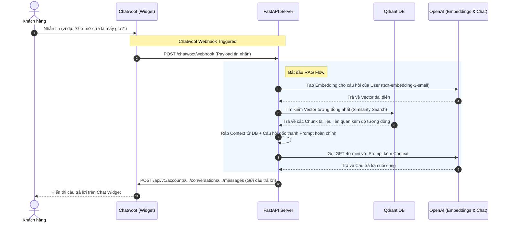

# Kế hoạch triển khai: RAG Base Project tích hợp Chatwoot

Dự án này nhằm mục đích xây dựng một hệ thống Retrieval-Augmented Generation (RAG) đơn giản, trực quan và dễ hiểu nhất để người học có thể nắm vững luồng hoạt động end-to-end từ lúc nhận webhook Chatwoot, embedding câu hỏi, tìm kiếm vector database Qdrant, gửi context cho OpenAI LLM và phản hồi lại Chatwoot.

---

## Cấu trúc thư mục đề xuất

Để giữ cho dự án đơn giản, trực quan và không bị "over-engineering", chúng ta sẽ tổ chức code theo cấu trúc phẳng nhưng phân chia nhiệm vụ rõ ràng:

```text
d:\rag\
├── docker-compose.yml     # Khởi chạy Qdrant Vector Database
├── requirements.txt       # Các thư viện Python cần thiết
├── .env.example           # File cấu hình mẫu (OpenAI API Key, Qdrant URL, Chatwoot Credentials)
├── README.md              # Tài liệu hướng dẫn cài đặt, chạy thử và giải thích chi tiết lý thuyết
├── main.py                # FastAPI Application & Routing (Các endpoint POST /ingest, POST /chatwoot/webhook, GET /health)
├── rag_service.py         # Logic xử lý RAG (Chunking, Embedding, Vector Search, LLM Prompt)
└── chatwoot_service.py    # Logic tương tác với Chatwoot API (Gửi tin nhắn phản hồi)
```

---

## Luồng hoạt động chi tiết (End-to-End Flow)



---

## Các thành phần chính và giải thích

### 1. File cấu hình & Môi trường chạy
*   **[NEW] `docker-compose.yml`**: Khởi động Qdrant trên port `6333` và dashboard giao diện quản trị trên port `6333/dashboard`.
*   **[NEW] `requirements.txt`**: Khai báo các thư viện:
    *   `fastapi` & `uvicorn` (xây dựng web API)
    *   `qdrant-client` (giao tiếp với Qdrant DB)
    *   `openai` (giao tiếp với OpenAI API)
    *   `python-dotenv` (quản lý biến môi trường)
    *   `httpx` (gửi request HTTP bất đồng bộ đến Chatwoot API)
*   **[NEW] `.env.example`**: Các cấu hình như `OPENAI_API_KEY`, `QDRANT_URL`, `CHATWOOT_API_KEY`, `CHATWOOT_URL`.

### 2. Các file mã nguồn chính
*   **[NEW] main.py**:
    *   Khởi tạo FastAPI app.
    *   Endpoint `GET /health`: Kiểm tra trạng thái hệ thống.
    *   Endpoint `POST /ingest`: Nhận một văn bản dài từ admin, thực hiện chunking, embedding và lưu trữ vào Qdrant.
    *   Endpoint `POST /chatwoot/webhook`: Nhận sự kiện từ Chatwoot khi có tin nhắn mới từ user. Lọc đúng loại tin nhắn (chỉ xử lý tin nhắn từ khách hàng - `incoming`), kích hoạt luồng RAG và gửi phản hồi lại Chatwoot.
*   **[NEW] rag_service.py**:
    *   *Chunking*: Chia nhỏ văn bản dài thành các đoạn nhỏ (ví dụ: kích thước 500 ký tự, overlap 50 ký tự) để đảm bảo context truyền vào LLM được cô đọng và chính xác.
    *   *Embedding*: Sử dụng `text-embedding-3-small` để chuyển hóa text sang vector 1536 chiều.
    *   *Vector Search*: Khởi tạo collection trong Qdrant nếu chưa tồn tại, insert vector chunks và thực hiện query tìm kiếm cosine similarity.
    *   *LLM Prompt*: Xây dựng Prompt dạng:
        ```text
        Bạn là trợ lý ảo hỗ trợ khách hàng. Hãy trả lời câu hỏi dựa trên ngữ cảnh dưới đây.
        Nếu không có thông tin trong ngữ cảnh, hãy nói "Tôi không có thông tin về vấn đề này".
        
        Ngữ cảnh:
        {CONTEXT}
        
        Câu hỏi:
        {QUESTION}
        ```
*   **[NEW] chatwoot_service.py**:
    *   Gửi yêu cầu HTTP POST đến API của Chatwoot để tạo tin nhắn mới (phản hồi) trong conversation tương ứng.

---

## Kế hoạch xác minh (Verification Plan)

### Kiểm thử tự động & Thủ công
1.  **Chạy docker-compose** để khởi tạo Qdrant:
    ```bash
    docker-compose up -d
    ```
2.  **Chạy FastAPI server**:
    ```bash
    python -m venv venv
    .\venv\Scripts\activate   # Trên Windows
    pip install -r requirements.txt
    uvicorn main:app --reload --port 8000
    ```
3.  **Kiểm tra endpoint `/ingest`** bằng cách gửi tài liệu mẫu (ví dụ: Chính sách giao hàng, Giờ hoạt động).
4.  **Kiểm tra luồng `/chatwoot/webhook`** bằng cách sử dụng công cụ Postman/cURL giả lập payload webhook của Chatwoot để xem hệ thống trả lời chính xác dựa trên tài liệu đã ingest.

---

## Câu hỏi & Trao đổi thêm với User
> [!NOTE]
> Bạn có muốn bổ sung thêm bất kỳ logic đặc biệt nào trong luồng xử lý tin nhắn Chatwoot không? (Ví dụ: Chỉ trả lời khi cuộc hội thoại ở trạng thái `open`, hoặc tự động gán nhãn, bỏ qua tin nhắn từ Bot khác, v.v.)
> Nếu bạn đồng ý với kế hoạch đơn giản, tinh gọn và đầy tính giáo dục này, hãy nhấn **Xác nhận** để tôi bắt đầu viết mã nguồn chi tiết cùng tài liệu giải thích học thuật nhé!
